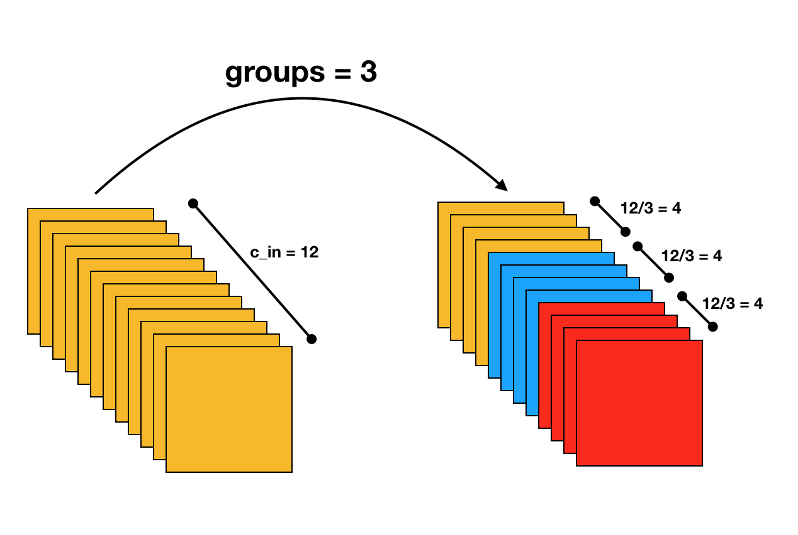
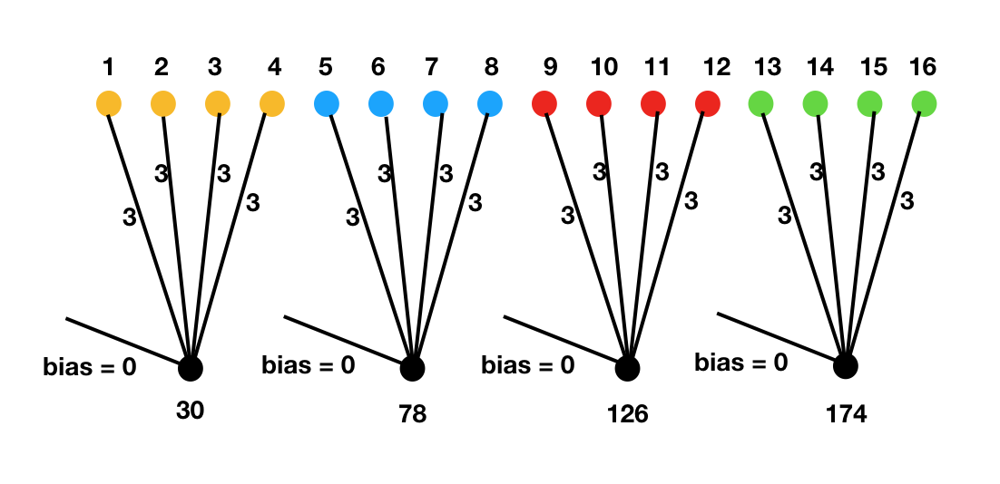

### Groups in convolution

It is easier to read the explanation and then look at the visuals and the code to understand how it works. There will not be much text to explain what is going on.

In the code shown below, x has value `(c % 16) + 1` where `c` is the index of second axis.


```python
import torch
import torch.nn as nn
from itertools import product

x = torch.ones(2,16,10,10)
for n,c,h,w in product( *[range(i) for i in x.size()] ):
    val = (c % 16) + 1
    x[n,c,h,w] = val
```

### Official documentation:

* `groups` controls the connections between inputs and outputs.
* `in_channels` and `out_channels` must both be divisible by `groups`. For example,

    * At groups=1, all inputs are convolved to all outputs.
    * At groups=2, the operation becomes equivalent to having two conv
      layers side by side, each seeing half the input channels,
      and producing half the output channels, and both subsequently
      concatenated.
    * At groups= `in_channels`, each input channel is convolved with
      its own set of filters

Here is how it can be explained visually:



Define convolutional layers with number of groups = 1,2 and 4:

```python
conv_g1 = nn.Conv2d(in_channels=16, out_channels=4, kernel_size=1, groups=1)
conv_g2 = nn.Conv2d(in_channels=16, out_channels=4, kernel_size=1, groups=2)
conv_g4 = nn.Conv2d(in_channels=16, out_channels=4, kernel_size=1, groups=4)
conv_nets = [conv_g1, conv_g2, conv_g4]
```

Can you guess what the size of the weights looks like?

```python
_ = [print(conv.weight.size()) for conv in conv_nets]
```

    torch.Size([4, 16, 1, 1])
    torch.Size([4, 8, 1, 1])
    torch.Size([4, 4, 1, 1])


```python
_ = [print(conv.bias.size()) for conv in conv_nets]
```

    torch.Size([4])
    torch.Size([4])
    torch.Size([4])

Initialize the parameters to have unit weights and zero biases:

```python
for index, conv in enumerate(conv_nets, 1):
    nn.init.constant_(conv.weight, index)
    nn.init.constant_(conv.bias, 0)
```


```python
_ = [print(conv.weight.mean().item()) for conv in conv_nets]
```

    1.0
    2.0
    3.0


```python
_ = [print(conv.bias.mean().item()) for conv in conv_nets]
```

    0.0
    0.0
    0.0

Regardless of the number of groups, the output size will always be the same:

```python
_ = [print(conv(x).size()) for conv in conv_nets]
```

    torch.Size([2, 4, 10, 10])
    torch.Size([2, 4, 10, 10])
    torch.Size([2, 4, 10, 10])

But the values will be different:

```python
_ = [print(conv(x).mean().item()) for conv in conv_nets]
```

    136.0
    136.0
    102.0


```python
y = conv_g4(x)
```




```python
for i in range(4):
    print(y[:,i].mean(1))
```

    tensor([[ 30.,  30.,  30.,  30.,  30.,  30.,  30.,  30.,  30.,  30.],
            [ 30.,  30.,  30.,  30.,  30.,  30.,  30.,  30.,  30.,  30.]])
    tensor([[ 78.,  78.,  78.,  78.,  78.,  78.,  78.,  78.,  78.,  78.],
            [ 78.,  78.,  78.,  78.,  78.,  78.,  78.,  78.,  78.,  78.]])
    tensor([[ 126.,  126.,  126.,  126.,  126.,  126.,  126.,  126.,  126.,
              126.],
            [ 126.,  126.,  126.,  126.,  126.,  126.,  126.,  126.,  126.,
              126.]])
    tensor([[ 174.,  174.,  174.,  174.,  174.,  174.,  174.,  174.,  174.,
              174.],
            [ 174.,  174.,  174.,  174.,  174.,  174.,  174.,  174.,  174.,
              174.]])
