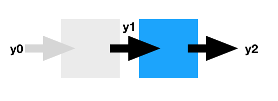
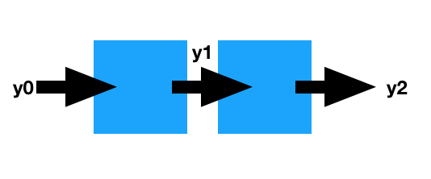

[1. Simple example](https://github.com/vinsis/understanding-neuralnetworks-pytorch/blob/master/backprop.md#1-simple-example)

* [Define a batch of 8 inputs](https://github.com/vinsis/understanding-neuralnetworks-pytorch/blob/master/backprop.md#define-a-batch-of-8-inputs)

* [Note on values of gradients:](https://github.com/vinsis/understanding-neuralnetworks-pytorch/blob/master/backprop.md#note-on-values-of-gradients)

* [`x.sum(0)` is same as the weight gradients:](https://github.com/vinsis/understanding-neuralnetworks-pytorch/blob/master/backprop.md#xsum0-is-same-as-the-weight-gradients)

[2. Losses calculated from two different batches in two different ways](https://github.com/vinsis/understanding-neuralnetworks-pytorch/blob/master/backprop.md#2-losses-calculated-from-two-different-batches-in-two-different-ways)

* [A note on values of gradients](https://github.com/vinsis/understanding-neuralnetworks-pytorch/blob/master/backprop.md#a-note-on-values-of-gradients)

[ 3. Using `nn.utils.clip_grad_norm` to prevent exploding gradients](https://github.com/vinsis/understanding-neuralnetworks-pytorch/blob/master/backprop.md#3-using-nnutilsclip_grad_norm-to-prevent-exploding-gradients)

* [`nn.utils.clip_grad_norm` returns total norm of parameter gradients _before_ they are clipped](https://github.com/vinsis/understanding-neuralnetworks-pytorch/blob/master/backprop.md#nnutilsclip_grad_norm-returns-total-norm-of-parameter-gradients-before-they-are-clipped)

[4. Using `detach()`](https://github.com/vinsis/understanding-neuralnetworks-pytorch/blob/master/backprop.md#using-detach)

* [Another example of `detach`](https://github.com/vinsis/understanding-neuralnetworks-pytorch/blob/master/backprop.md#another-example-of-detach)

* [Not detaching `y1`:](https://github.com/vinsis/understanding-neuralnetworks-pytorch/blob/master/backprop.md#not-detaching-y1)

* [When is `detach()` used?](https://github.com/vinsis/understanding-neuralnetworks-pytorch/blob/master/backprop.md#when-is-detach-used)

### 1. Simple example

Consider a fully connected layer with 5 input neurons and 2 output neurons. Let's feed it a batch of 8 inputs, each with dimension 5:


```python
import torch
from torch.autograd import Variable
import torch.nn as nn
```

Since no gradient has been backpropogated, its weights are all `None`:


```python
linear = nn.Linear(5,2)
print('=== Weights and biases ===')
_ = [print(p.data) for p in linear.parameters()]
print('===      Gradients     ===')
print([p.grad for p in linear.parameters()])
```

    === Weights and biases ===

    -0.3933  0.3731  0.1929 -0.3506  0.4152
    -0.2833 -0.2681 -0.0346  0.2800 -0.2322
    [torch.FloatTensor of size 2x5]


     0.4141
     0.2196
    [torch.FloatTensor of size 2]

    ===      Gradients     ===
    [None, None]


#### Define a batch of 8 inputs


```python
x = Variable(torch.randn(8,5))
y = linear(x)
y
```


    Variable containing:
     1.0078 -0.4197
     1.7015 -0.4344
    -0.1489  0.5115
     0.0158 -0.3754
     2.0604 -0.3813
     0.0680  0.7753
     1.1815 -0.1078
     1.5967  0.0897
    [torch.FloatTensor of size 8x2]


Let's assume the gradient of loss with respect to `y` is 1. We can backpropogate these gradients using `y.backward`:


```python
grads = Variable(torch.ones(8,2))
y.backward(grads)
```

The parameters of the linear layer (weights and biases) now have non-None values:


```python
print('=== Weights and biases ===')
_ = [print(p.data) for p in linear.parameters()]
print('===      Gradients     ===')
print([p.grad for p in linear.parameters()])
```

    === Weights and biases ===

    -0.3933  0.3731  0.1929 -0.3506  0.4152
    -0.2833 -0.2681 -0.0346  0.2800 -0.2322
    [torch.FloatTensor of size 2x5]


     0.4141
     0.2196
    [torch.FloatTensor of size 2]

    ===      Gradients     ===
    [Variable containing:
    -0.6444  3.9640  3.1489 -1.0274  3.5395
    -0.6444  3.9640  3.1489 -1.0274  3.5395
    [torch.FloatTensor of size 2x5]
    , Variable containing:
     8
     8
    [torch.FloatTensor of size 2]
    ]


#### Note on values of gradients:

To make it easy to understand, let's consider only on neuron.

For a given linear neuron which does the following operation ...

> $y = \sum_{i=1}^n w_i x_i + b $

... the derivatives wrt bias and weights are given as:

> $\frac{\partial Loss}{\partial b} = \frac{\partial Loss}{\partial y}$

and

> $\frac{\partial Loss}{\partial w_i} = \frac{\partial Loss}{\partial y} * x_i$

Also note that these operations take place _per input sample_. In our case, there are __eight__ samples and the above operations take place eight times. For each sample, we have $\frac{\partial Loss}{\partial y} = 1$. Hence, we do the following operation eight times:

$\frac{\partial Loss}{\partial b} = 1$

Each time, the new gradient gets added to the existing gradient. Hence, the final value of $\frac{\partial Loss}{\partial b}$ is equal to 8.

Similarly, for each sample input `i`, we have:

$\frac{\partial Loss}{\partial w_i} = \frac{\partial Loss}{\partial y} * x_i = x_i$

After backpropagating for each of the eight samples, the final value of $\frac{\partial Loss}{\partial w_i}$ is
$\sum_{i=1}^8 x_i$

Let's verify this:

#### `x.sum(0)` is same as the weight gradients:


```python
x.sum(0)
```


    Variable containing:
    -0.6444
     3.9640
     3.1489
    -1.0274
     3.5395
    [torch.FloatTensor of size 5]


```python
linear.weight.grad
```


    Variable containing:
    -0.6444  3.9640  3.1489 -1.0274  3.5395
    -0.6444  3.9640  3.1489 -1.0274  3.5395
    [torch.FloatTensor of size 2x5]


Before we move on, make sure you've understood everything up until this point.

---

### 2. Losses calculated from two different batches in two different ways

Consider two batches `x1` and `x2` of sizes 2 and 3 respectively:


```python
x1 = Variable(torch.randn(2,5))
x2 = Variable(torch.randn(3,5))
y1, y2 = linear(x1), linear(x2)
print(y1.data)
print(y2.data)
```


     1.3945  0.9929
     0.3436 -0.1620
    [torch.FloatTensor of size 2x2]


    -0.1487  0.1283
     1.3610  0.0088
    -0.3215  0.2808
    [torch.FloatTensor of size 3x2]


Let's assume the target values for `y1` and `y2` are all 1. But we want to give the loss from `y2` twice the weight:


```python
loss = (1 - y1).sum() + 2*(1 - y2).sum()
print(loss)
```

    Variable containing:
     10.8135
    [torch.FloatTensor of size 1]


Make sure the gradients of our layer are reset to zero before we backprop again:


```python
linear.zero_grad()
[p.grad for p in linear.parameters()]
```


    [Variable containing:
      0  0  0  0  0
      0  0  0  0  0
     [torch.FloatTensor of size 2x5], Variable containing:
      0
      0
     [torch.FloatTensor of size 2]]


```python
loss.backward()
print('===      Gradients     ===')
print([p.grad for p in linear.parameters()])
```

    ===      Gradients     ===
    [Variable containing:
    -0.0289 -1.5594 -0.9259 -0.7791  0.6483
    -0.0289 -1.5594 -0.9259 -0.7791  0.6483
    [torch.FloatTensor of size 2x5]
    , Variable containing:
    -8
    -8
    [torch.FloatTensor of size 2]
    ]


#### A note on values of gradients

Here, we have:

> $\frac{\partial Loss}{\partial y1} = -1$. This operation takes place for each sample in `x1` (i.e. 2 times)

and

> $\frac{\partial Loss}{\partial y2} = -2$. This operation takes place for each sample in `x2` (i.e. 3 times)

For each case we have:

> $\frac{\partial Loss}{\partial b} = \frac{\partial Loss}{\partial y}$

Thus the final value of $\frac{\partial Loss}{\partial b}$ is:

$2 * -1 + 3 * -2 = -8$

Similarly, __weight gradients are equal to negative of `x1.sum(0) + 2*x2.sum(0)`__

Let's verify this:


```python
-1 * (x1.sum(0) + 2*x2.sum(0))
```


    Variable containing:
    -0.0289
    -1.5594
    -0.9259
    -0.7791
     0.6483
    [torch.FloatTensor of size 5]


```python
linear.weight.grad
```


    Variable containing:
    -0.0289 -1.5594 -0.9259 -0.7791  0.6483
    -0.0289 -1.5594 -0.9259 -0.7791  0.6483
    [torch.FloatTensor of size 2x5]


---

###  3. Using `nn.utils.clip_grad_norm` to prevent exploding gradients

_After_ the gradients have been backpropagated, the gradients can be clipped to keep them small. This can be done using `nn.utils.clip_grad_norm` like so:


```python
linear.zero_grad()
x = Variable( torch.randn(8,5) )
y = linear(x)
grads = Variable( torch.ones(8,2) )
y.backward(grads)
```


```python
[p.grad.norm() for p in linear.parameters()]
```


    [Variable containing:
      8.7584
     [torch.FloatTensor of size 1], Variable containing:
      11.3137
     [torch.FloatTensor of size 1]]


#### `nn.utils.clip_grad_norm` returns total norm of parameter gradients _before_ they are clipped


```python
nn.utils.clip_grad_norm(linear.parameters(), 3)
```


    14.30769861897899


Let's verify this:


```python
(8.7584**2 + 11.3137**2)**0.5 # should be the same as the value returned by the clip_grad_norm above
```


    14.307668512025291


The norm of the new gradients is 3 now:


```python
[p.grad.norm() for p in linear.parameters()]
```


    [Variable containing:
      1.8364
     [torch.FloatTensor of size 1], Variable containing:
      2.3722
     [torch.FloatTensor of size 1]]


```python
(1.8364**2 + 2.3722**2)**0.5
```


    2.999949632910526


### Using `detach()`

Remember that a PyTorch `Variable` contains history of a graph (if it is a part of a graph, obviously). This includes intermediate values and backprop operations in the graph. In the example below, `y` requires a gradient and the first operation it will do during backprop is `AddmmBackward`


```python
linear.zero_grad()

x = Variable(torch.randn(8,5))
y = linear(x)
print(y.requires_grad, y.grad_fn)
```

    True <AddmmBackward object at 0x10b59bbe0>


When we create a new Variable, say `y_new` from `y` having the same data as `y`, `y_new` does not get the graph-related history from `y`. It only gets the data from `y`. Hence, in the example below, `y_new` does not require a gradient and its `grad_fn` is `None`:


```python
y_new = Variable(y.data)
print(y_new.requires_grad, y_new.grad_fn)
```

    False None


You can say that `y_new` is _detached_ from the graph. When a backprop operation encounters `y_new`, it will see that its `grad_fn` is `None` and it will not continue backpropagating along the path where `y_new` was encountered.

One can achieve the same effect without defining a new variable; just call the `detach()` method. There's also a `detach_()` method for in-place operation.

Let's understanding it in greater detail.


```python
y_detached = y.detach()
print(y_detached.requires_grad, y_detached.grad_fn)
```

    False None


```python
print(y.requires_grad, y.grad_fn)
y.detach_()
print(y.requires_grad, y.grad_fn)

```

    True <AddmmBackward object at 0x10b546518>
    False None


Let's understand it in greater detail.

### Another example of `detach`

Consider two serial operations on a single fully connected layer. Notice that `y1` is detached _before_ `y2` is calculated. Thus, backpropagation from `y2` will stop at `y1`. The gradients of the linear layer are calculated as if `y1` was a leaf variable. The gradient values can be calculated in a fashion similar to what we did in [our simple example](#1-Simple-example)




```python
linear = nn.Linear(4,4)
y0 = Variable( torch.randn(10,4) )
y1 = linear(y0)
y1.detach_()
y2 = linear(y1)
```


```python
[p.grad for p in linear.parameters()]
```


    [None, None]


```python
y2.backward( torch.ones(10,4) )
[p.grad for p in linear.parameters()]
```


    [Variable containing:
      0.7047 -1.9666  4.8305 -0.1647
      0.7047 -1.9666  4.8305 -0.1647
      0.7047 -1.9666  4.8305 -0.1647
      0.7047 -1.9666  4.8305 -0.1647
     [torch.FloatTensor of size 4x4], Variable containing:
      10
      10
      10
      10
     [torch.FloatTensor of size 4]]


Note how the weight gradients are simply the sum of $x_is$:


```python
y1.sum(0)
```


    Variable containing:
     0.7047
    -1.9666
     4.8305
    -0.1647
    [torch.FloatTensor of size 4]


### Not detaching `y1`:

In this case, backpropagation will continue beyond `y1`:



Let's verify this. For sake of simplicity, let's just take a look at how bias gradients are calculated.

When gradients from `y2` are backpropagated, similar to the calculations we did in [our simple example](#1-Simple-example), we have:

> $\frac{\partial Loss}{\partial bias} = 10$

When gradients from `y1` are backpropagated, for a neuron $y1_i$, we have:

> $\frac{\partial Loss}{\partial y1_i} = \sum_{i=1}^4 \frac{\partial Loss}{\partial w1_i} * w1_i = \sum_{i=1}^4 w1_i$

and finally:

> $\frac{\partial Loss}{\partial bias} = $\frac{\partial Loss}{\partial y1_i}$

Hence, final bias gradient is equal to:

$10 + \sum_{i=1}^4 w1_i$

Let's verify this:


```python
y1 = linear(y0)
y2 = linear(y1)
linear.zero_grad()
y2.backward( torch.ones(10,4) )
```


```python
linear.bias.grad
```


    Variable containing:
      4.5625
      4.7037
     14.1218
      5.4621
    [torch.FloatTensor of size 4]


Now let's calculate $10 + \sum_{i=1}^4 w1_i$. The result should be (and is) equal to the bias gradients shown above:


```python
10 + (linear.weight.sum(0) * 10)
```


    Variable containing:
      4.5625
      4.7037
     14.1218
      5.4621
    [torch.FloatTensor of size 4]


#### When is `detach()` used?

It can useful when you don't want to backpropagate beyond a few steps in time, for example, in training language models.
